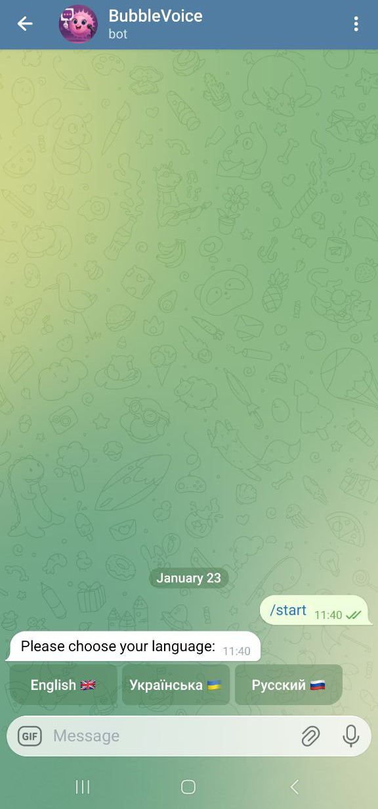
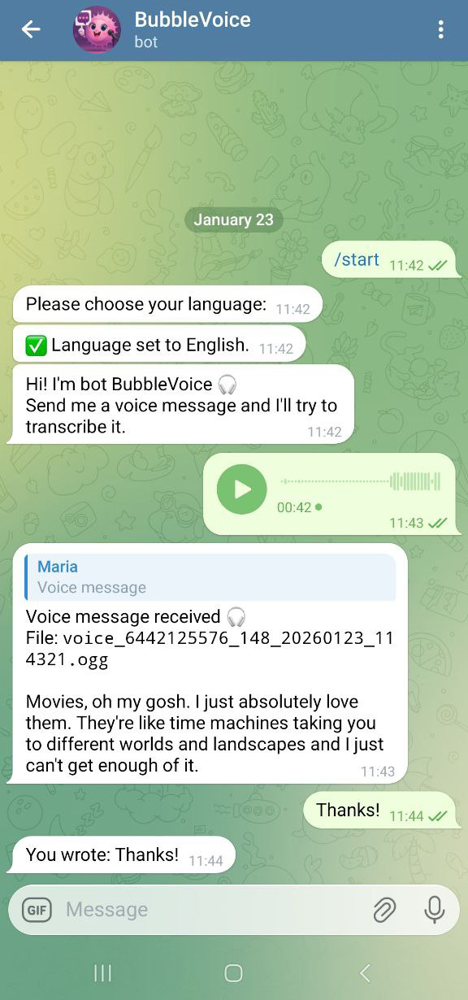

<p align="center">
  
</p>

<p align="center">
  
  
  
  
</p>

# BubbleVoice 🎧

Telegram bot that converts voice messages into text using local Whisper and ffmpeg.
Supports a multilingual interface (EN / RU / UK).

---

## Features

- 🎙️ Voice message transcription
- 🌍 Multilingual interface (English / Русский / Українська)
- 🗣️ Language selection via /start and /language commands
- 🧠 Local Whisper model (no external APIs)
- ☁️ Optional Deepgram cloud transcription backend
- 🔊 Audio conversion via ffmpeg (OGG/MP3/MP4 → WAV 16 kHz)
- ⚙️ Configurable via environment variables
- 📝 Structured logging

---

## Requirements

- Python 3.10+
- ffmpeg
- Telegram Bot Token

---

## Screenshots

<p align="center">
  
  
</p>

## Setup

### 1. Clone the repository

```bash
git clone https://github.com/machinatororis/telegram-voice2text-bot.git
cd telegram-voice2text-bot
```

### 2. Create virtual environment

```
python -m venv .venv
source .venv/bin/activate  # Linux / macOS
```
or
```
.venv\Scripts\activate     # Windows
```

### 3. Install dependencies

```
pip install -r requirements.txt
```

## Configuration (.env)

Create a ```.env``` file in the project root (it is ignored by git).

You can use ```.env.example``` as a starting point.

## Transcription backends

BubbleVoice supports multiple speech-to-text backends.
The active backend is selected via environment variables.

### Local Whisper (default)

By default, the bot uses local Whisper for transcription:

```env
TRANSCRIBER_BACKEND=whisper
```

This mode:
- Runs fully locally.
- Does not require external APIs.
- Requires ffmpeg and Whisper to be available on the system.

### Deepgram (cloud backend)

Deepgram can be used as an alternative cloud-based transcription backend.

Requirements:
- A Deepgram account.
- A valid Deepgram API key.

**Environment variables:**
```env
TRANSCRIBER_BACKEND=deepgram
DG_API_KEY=your_deepgram_api_key
```

### Required variables
```
BOT_TOKEN=your_telegram_bot_token
```

### Optional variables
```
LOG_LEVEL=INFO
```

## FFMPEG_PATH (optional)

By default the app tries to run ```ffmpeg``` from the system ```PATH```.

If you deploy to a server or use a custom ffmpeg installation, you can manually specify the path to the executable:

### Linux:
```
FFMPEG_PATH=/usr/local/bin/ffmpeg
```

### Windows:
```
FFMPEG_PATH=C:\ffmpeg\bin\ffmpeg.exe
```
If ```FFMPEG_PATH``` is set but invalid, the app will fall back to searching ```ffmpeg``` in ```PATH```.

## Run the bot
```
python main.py
```
The `main.py` file is the application entry point and initializes
logging, configuration, and bot handlers.

## Notes

* ```.env``` is intentionally excluded from git.

* Use ```.env.example``` for reference.

* For server deployments, ```FFMPEG_PATH``` is recommended if ffmpeg is not in PATH.

* Audio is sent to Deepgram as 16 kHz mono WAV.

* The nova-3-general model is used with automatic language detection.

* If Deepgram returns an error or times out, the bot logs the error and automatically falls back to local Whisper without crashing.
